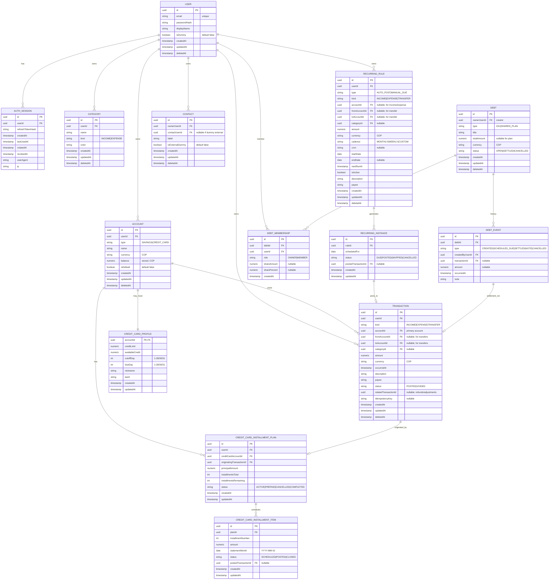

# agents.md (Backend — NestJS + TypeORM)

This file is the working agreement for AI agents and humans contributing to the backend of the Personal Finance App.

## Scope (V1)

Backend responsibilities:

- User authentication (email/password)
- JWT access tokens + **rotating refresh tokens**
- Users (no roles)
- Accounts (Savings + Credit Card)
- Transactions (income/expense/transfer)
- Credit card statement logic (cutoff/due dates, available credit)
- Installments for credit-card purchases (with prepay/cancel)
- Recurring payments (auto-post + manual-due)
- Social: peer transfers (including **dummy users**) + shared debts with settlement history

Non-goals (V1):

- Bank integrations
- Multi-currency
- Email verification
- Roles/permissions beyond “user owns their data”
- Partial debt payments (UI/feature), but settlement history exists

---

## Project conventions

### Tech

- NestJS (modules-first)
- TypeORM (PostgreSQL recommended)
- Migrations: TypeORM migrations (no synchronize in prod)
- Timezone: **America/Bogota**
- Currency: **COP** only (store `currency` column for future, default `COP`)

### Code style

- Prefer small modules: `auth`, `users`, `accounts`, `transactions`, `recurring`, `debts`
- Business logic lives in services; controllers should be thin.
- Use DTOs + validation (class-validator) at the edge.
- Use explicit enums for transaction kinds, account types, recurring types/status.
- Always add or update tests for any production code changes. If tests are not feasible, document why in the PR/notes.

### IDs & timestamps

- Use UUID primary keys.
- Tables should include: `createdAt`, `updatedAt`, optional `deletedAt` (soft delete where appropriate).
- Financial records should prefer “append-only” semantics; if editing transactions is allowed, implement as reversal + new transaction (ledger-friendly).

---

## Security model

### Access token (JWT)

- Short-lived (e.g., 10–15 minutes)
- Contains: `sub` (userId), `email`, `iat`, `exp`
- Signed with `JWT_ACCESS_SECRET`

### Refresh token (rotating)

- Stored server-side as hashed token per session.
- Rotation rules:
  - Each refresh request invalidates the previous refresh token (replace row tokenHash, bump `rotatedAt`)
  - Reuse detection: if an old refresh token is used after rotation, revoke the session.
- Multi-device: each login creates a new session row.

---

## Data ownership & multi-tenancy

- Every record is scoped by `userId` (owner) unless explicitly shared.
- Shared objects (debts) have membership rows that grant access.
- “Dummy users” can exist as placeholders; they also get a default savings account.

---

## API surface (high-level)

### Auth

- `POST /auth/register`
- `POST /auth/login`
- `POST /auth/refresh`
- `POST /auth/logout` (revokes session)
- `GET /auth/me`

### Accounts

- `GET /accounts`
- `POST /accounts` (create credit card or additional savings)
- `GET /accounts/:id`
- `PATCH /accounts/:id`

### Transactions

- `GET /transactions?from=&to=&accountId=&kind=&categoryId=`
- `POST /transactions`
- `PATCH /transactions/:id` (prefer reversal strategy internally)
- `DELETE /transactions/:id` (soft delete)

### Recurring

- `GET /recurring`
- `POST /recurring`
- `PATCH /recurring/:id`
- `POST /recurring/:id/run` (manual trigger, admin/dev)
- `POST /recurring/:id/mark-paid` (manual bills)

### Debts / Social

- `GET /people` (users + dummy users you’ve interacted with)
- `POST /people/dummy`
- `GET /debts`
- `POST /debts`
- `POST /debts/:id/settle` (creates settlement txn + history)
- `GET /debts/:id/history`

---

## Financial logic (V1 rules)

### Account balance (stored)

- Balances are stored and updated transactionally.
- Any write that affects balances must be wrapped in a DB transaction:
  - Insert transaction(s)
  - Update balances (and credit card availability)
  - Insert any derived records (installment schedule items, recurring instances, etc.)

### Transaction kinds

- `INCOME`: +amount to `account.balance`
- `EXPENSE`: -amount from `account.balance` (savings)
- `TRANSFER`: -amount from `fromAccount.balance` and +amount to `toAccount.balance`
- Credit card purchases are modeled as `EXPENSE` on a credit-card account:
  - Update `availableCredit -= amount`
  - Do **not** treat it like cash leaving savings.

### Credit card payment

- Modeled as `TRANSFER` from savings -> credit card account:
  - Savings decreases
  - Credit card “debt” decreases (can be modeled as negative balance or separate aggregates; see DB notes)
  - `availableCredit += paymentAmount` (bounded by credit limit)

### Installments

- A credit-card purchase may have `installmentsTotal >= 1`.
- Statement impact is by installment schedule.
- User can:
  - **prepay** remaining installments (creates a payment event and closes schedule items)
  - **cancel** remaining installments (creates adjustment + closes schedule items)

### Recurring payments

Two types:

- `AUTO_POST`: creates posted transactions on schedule.
- `MANUAL_DUE`: creates due instances; user marks paid to create posted transactions.

---

## Database structure (Mermaid ER diagram)

> Notes:
>
> - This diagram shows V1 tables + relationships.
> - Some derived fields (e.g., statement totals) can be computed in queries; balances are stored.
> - Debt “shared plans” are represented as `Debt` with optional recurrence rules.

